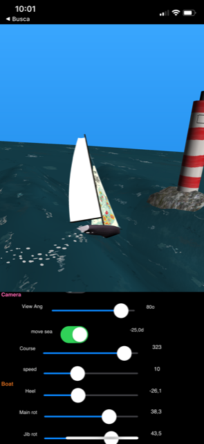
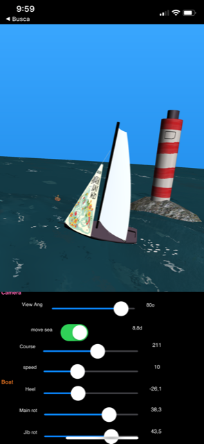

# SailboatDemo

This demo application was added to this fork of GBE3D, by Gregory Bersegeay. 
It is a Delphi Firemonkey 3D application. 

Features:
* Sailboatdemo is based on original GBE3D sample *waterdemo*.
* Multi platform: Windows, iOS and Android.
* racer boat hull 3D model made with Blender ( embedded )
* Main and jib sails with camber and quadratic leech. Configurable and dynamic sail mesh.
* Ocean surface moves and the boats stays in the center, with configurable course and speed. 
* Boat floats on waves and changes pitch to match the surface.
* Objects parented to the OceanSurface float on it (like the boat wake bubbles).
* A system of TDummys allow setting boat's *course*, *heel* and *sail rotation* for main and jib sails. 
* A rock with a lighthouse (but no collision detection yet).
* A few floating objects. 
* As the boat moves, it leaves a trail of floating bubbles. Bubbles are recycled over time.  
* Only one small sea surface sandbox. Boat automaticaly makes U turn when leaving the 30x30 mesh.
* Large textured TDisk represents the sea horizon.
* Scrollable listbox contains the app control: camera, boat, waves and object positioning. 
* Camera controls: AngleOfView or switch to design camera.
* Boat controls: movement, Course, Speed, Heel, jib and main sheet.
* 3 waves w/ configurable params: Amplitude, Longueur, Vitesse and Origine.
* All assets (3d model and textures) are embedded in the form file (fSailboatDemo.fmx). That is why it is so big.

In order to compile this demo, you have to compile and install the GBE3D design package in this fork,
as I have added a few components.

## Video
http://www.youtube.com/watch?v=bBpZxB8GLpg   SailboatDemo on Youtube

 

